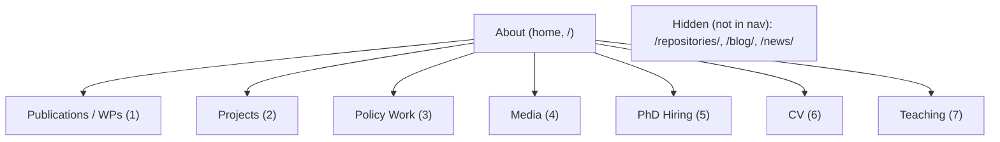

# Site Overview and Recommendations

> **Purpose of this document.** This is a self-contained briefing for an AI assistant (or a new human collaborator) who has never seen this website before. Part A explains what the website is, who it is for, how it is built, and how its content is organised. Part B lists the top 10 improvements that were proposed and records what has since been implemented.
>
> **Status:** The improvements in Part B have now been actioned according to the site owner's decisions (see the status table at the start of Part B). This document has been updated to describe the site **as it currently stands** after those changes.

---

## Part A — Contextualisation

### A.1 One-paragraph summary

This is the **personal academic website of Dr Andrea Giovannetti**, a quantitative social scientist working at the intersection of **economics, quantitative criminology, network science, and counter-terrorism / countering violent extremism (CVE)**. The site is a customised [Jekyll](https://jekyllrb.com/) static site built on the **al-folio** academic theme, deployed to **GitHub Pages** at `https://andrea-giovannetti.github.io/site`. Its job is to present, in one clean place, Andrea's research projects, publications, policy work, media/public engagement, teaching, grants, and PhD hiring — for two audiences: fellow academics, and, crucially, **government bodies, funders, and agencies** in Australia and internationally. The intended look is deliberately **informal** in tone while remaining clean and professional.

### A.2 Who the site is about

Andrea Giovannetti (source: [_pages/about.md](_pages/about.md), [_config.yml](_config.yml)):

- **Current roles:** Lecturer (equivalent to US Assistant Professor) in **Economics and Quantitative Methods** at the **Faculty of Law and Business, Australian Catholic University (ACU)**, Sydney; **Co-Director of the [Tackling Hate Lab](https://tacklinghate.org)**.
- **Affiliations:** Visiting position at the **Institute of Criminology, University of Cambridge**; member of the **Violence Research Centre**; associate researcher at **Darwin College, Cambridge**.
- **Background:** PhD in Economics (2018, University of Southampton); research fellow at University of Technology Sydney (UTS), 2018–2021; former **Marie Skłodowska-Curie fellow** at Cambridge.
- **Research themes** (site subtitle): *Human Networks · Quantitative Criminology · Simulations and Metrics.* Concretely: organized crime groups and drug markets, online hate and extremism networks, social cohesion measurement, contagion in financial/supply-chain networks, and agent-based policy simulation.
- **Identifiers:** ORCID `0000-0001-7685-5644`; Google Scholar `HileARUAAAAJ`; X `@andrea-giovannetti`; LinkedIn `andrea-giovannetti`; email `andrea.giovannetti@acu.edu.au`.

### A.3 Target audiences and goals

1. **Academic peers** — especially quantitative criminologists, economists, and counter-terrorism / CVE researchers. They come for publications, working papers, methods, and collaboration/PhD opportunities.
2. **Stakeholders (the priority audience)** — government departments (e.g. Australian **Department of Home Affairs**, **NSW Premier's Department**), police forces (**Merseyside Police**, **Metropolitan Police**), funders (**ESRC**, **Nuffield Foundation**, **EU/Marie Curie**), and agencies active in national security, social cohesion, and organized-crime policy. They come for evidence of impact, credibility, deliverables, and reasons to fund or partner.

The stated intent is a **lean, elegant, uncomplicated, clean** research-intensive profile — informal in register but authoritative in substance — that also surfaces **public discourse and media**.

### A.4 Tech stack and how it is built/deployed

- **Generator:** Jekyll (Ruby), theme = **al-folio** (a popular academic Jekyll theme). Per [README.md](README.md), this repo is a customised fork of al-folio.
- **Key plugins** (from [_config.yml](_config.yml)): `jekyll/scholar` (BibTeX → publications page), `jekyll-archives`, `jekyll-paginate-v2`, `jekyll-feed`, `jekyll-sitemap`, `jekyll-imagemagick`, `jekyll-minifier`, `jekyll-twitter-plugin`, `jemoji`, `jekyll-toc`, `jekyll-diagrams`.
- **Front-end:** Bootstrap + MDBootstrap, FontAwesome/Academicons, MathJax, Masonry (project grid), medium-zoom (image zoom). Styling is SCSS under [_sass/](_sass) plus a small custom block in [assets/css/main.scss](assets/css/main.scss).
- **Hosting/deploy:** GitHub Pages. On push to `master`/`main`, [.github/workflows/deploy.yml](.github/workflows/deploy.yml) builds with Ruby 3.2.2 and publishes `_site` via `JamesIves/github-pages-deploy-action`. (There is no local Ruby toolchain on the author's machine; validation happens in CI on push.)
- **URL/base path:** `url: https://andrea-giovannetti.github.io`, `baseurl: /site`. **Important:** the site is served under the `/site` sub-path, so all internal links must resolve relative to that base (use `{{ '/path/' | relative_url }}` in templates).
- **SEO:** Open Graph meta tags and Schema.org `Person`/`WebSite` structured data are **enabled** (`serve_og_meta: true`, `serve_schema_org: true`). By deliberate choice there is **no `og_image`**, so shared links show title/description but no preview thumbnail.
- **Layout constraints:** `max_width: 800px`, fixed top navbar, a scroll progress bar; dark mode is **disabled** (deliberate).

### A.5 Information architecture (navigation)

The navbar is generated in [_includes/header.html](_includes/header.html) from pages that set `nav: true`, ordered by `nav_order`. The home/landing page is the "about" page. Page titles use normal capitalization (they are no longer forced to lowercase).

| Nav order | Label | Path | Source | Layout |
|-----------|-------|------|--------|--------|
| home | **About** | `/` | [_pages/about.md](_pages/about.md) | `about` |
| 1 | **Publications / WPs** | `/publications/` | [_pages/publications.md](_pages/publications.md) | `page` |
| 2 | **Projects** | `/projects/` | [_pages/projects.md](_pages/projects.md) | `page` |
| 3 | **Policy Work** | `/policy/` | [_pages/policy.md](_pages/policy.md) | `page` |
| 4 | **Media** | `/media/` | [_pages/media.md](_pages/media.md) | `page` |
| 5 | **PhD Hiring!** | `/openings/` | [_pages/PhD Hire.md](_pages/PhD%20Hire.md) | `page` |
| 6 | **CV** | `/cv/` | [_pages/cv.md](_pages/cv.md) | `cv` |
| 7 | **Teaching** | `/teaching/` | [_pages/teaching.md](_pages/teaching.md) | `page` |
| hidden | repositories | `/repositories/` | [_pages/repositories.md](_pages/repositories.md) | `page` (`nav: false`) |
| hidden | blog | `/blog/` | [blog/index.html](blog/index.html) | (blog not in nav; currently no posts) |
| hidden | news | `/news/` | [news.html](news.html) | `page` |

### A.6 Page-by-page inventory

- **Home / about** ([_pages/about.md](_pages/about.md), layout [_layouts/about.html](_layouts/about.html)): profile photo (`assets/img/prof_pic.jpg`), a bio, a numbered list of works in progress, a bulleted list of grants/awards (USD equivalents), and a **partner logo strip** (`partners_andrea` front-matter → Cambridge, Home Affairs, Merseyside/Met Police, Deakin, Tackling Hate, Siena, Oxford, Nagoya, Modena, EU, Bologna). Note: the introductory "(temporary) page" wording and the long working-paper/grants lists were intentionally left as-is by the owner.
- **Publications / WPs** ([_pages/publications.md](_pages/publications.md)): renders [_bibliography/papers.bib](_bibliography/papers.bib) via jekyll-scholar, grouped by year (descending), with Altmetric/Dimensions badges. Andrea's own name is now correctly highlighted (the Scholar author config points to Giovannetti).
- **Projects** ([_pages/projects.md](_pages/projects.md)): a Masonry card grid of the `_projects` collection, split by (capitalized) category in the order `[policy, research, academic, misc]`. Cards come from [_includes/projects.html](_includes/projects.html); card titles render with their real capitalization.
- **Policy Work** ([_pages/policy.md](_pages/policy.md)): same card mechanism, filtered to `category: policy` only — a stakeholder-facing subset of the projects.
- **Media** ([_pages/media.md](_pages/media.md)): public engagement and selected media coverage. Introduces and links the Sydney Morning Herald and The Age coverage of the Home Affairs CVE (Phase 2) study (Andrea as principal investigator), cross-links to that project, and notes ABC News coverage of the Tackling Hate Lab at the Royal Commission (Andrea as Co-Director). Designed to also hold talks/videos later.
- **PhD Hiring** ([_pages/PhD Hire.md](_pages/PhD%20Hire.md)): recruitment call for PhD students (ACU / Tackling Hate Lab). Informal tone and email emoji retained by choice.
- **CV** ([_pages/cv.md](_pages/cv.md), layout [_layouts/cv.html](_layouts/cv.html)): embeds `assets/pdf/andrea_cv.pdf` in an iframe with a PDF-download icon and a graceful download fallback. The layout markup was cleaned up (single description, valid iframe/container heights). The al-folio structured/JSON CV machinery is no longer present — this page is intentionally just the PDF.
- **Teaching** ([_pages/teaching.md](_pages/teaching.md)): courses taught at ACU, Cambridge, UTS; teaching awards/certificates (FHEA, UTS best-lecturer award, ACU teaching-innovation grant).
- **Repositories** ([_pages/repositories.md](_pages/repositories.md), hidden): GitHub user card + GitHub "trophies" for `andrea-giovannetti`. Left in place but not linked in the nav.
- **Blog / news** (hidden): the blog has no posts (the off-brand template post was removed); the news collection exists but is not shown on the home page.

### A.7 The `_projects` collection (the core content)

Each project is a Markdown file in [_projects/](_projects) with front-matter (`title`, `description`, `img` thumbnail, `category`, `importance` for sort order, optional `related_publications` which pulls matching BibTeX into a "References" block via [_layouts/page.html](_layouts/page.html)).

| File | Title | Category | Related pubs |
|------|-------|----------|--------------|
| [_projects/social_cohesion.md](_projects/social_cohesion.md) | A New Framework for Measuring Social Cohesion in Australia | policy | vergani2026cohesion18, link2026cohesion17 |
| [_projects/uk_riots_2024.md](_projects/uk_riots_2024.md) | The 2024 Riots of Merseyside | policy | vergani2026ukriots |
| [_projects/home_affairs_cve_phase2.md](_projects/home_affairs_cve_phase2.md) | Home Affairs — Countering Violent Extremism (Phase 2) | policy | giovannetti2025dro |
| [_projects/property_rights.md](_projects/property_rights.md) | Takeovers in Drug Markets | research | (rozzi2025, commented out) |
| [_projects/inoculation_pilot.md](_projects/inoculation_pilot.md) | Inoculation vs Deplatforming | research | (vergani2025synergies, commented out) |
| [_projects/merseyside1.md](_projects/merseyside1.md) | Gang Cooperation, Drugs and Violence in U.K. | research | campana2025structure, giovannetti2025theory |

All six projects now use the same clean, structured two-column pattern (Context / Aims / Methodology + `figure.html` figures + Key Findings / Implications + a `.team-members` box). Previously only `merseyside1.md` used ad-hoc inline-styled floats; it has been refactored to match the others.

### A.8 Publications and data files

- **[_bibliography/papers.bib](_bibliography/papers.bib)** — the real, current publication list (peer-reviewed articles in *Quantitative Finance*, *Journal of Criminal Justice*, *Terrorism and Political Violence*, etc., plus working papers/tech reports). Most entries link out to external PDFs (`pdf={https://...}`). Three entries also expose local supplementary PDFs via `supp={...}` (see below). The `related_publications` keys in project files match keys here.
- **[assets/pdf/](assets/pdf)** — contains `andrea_cv.pdf` (used by the CV page) plus paper/report PDFs. Local files now surfaced: `How_OCG_Interact_HO1.pdf` (supp of `giovannetti2025theory`), `Endogenous_Property_Rights_emp_supp.pdf` (supp of `rozzi2025`), `InoculationABM_5July.pdf` (supp of `vergani2025synergies`), and `Endogenous_Property_Rights.pdf` + `Endogenous_Property_Rights_theo_supp.pdf` (linked from the property-rights project page). `disinformation_home_office.pdf` remains unlinked (no confident matching entry).
- **[_data/repositories.yml](_data/repositories.yml)** — GitHub username for the hidden repositories page.
- **[_data/venues.yml](_data/venues.yml)** — now a documented, empty template (the physics-journal placeholders were removed). Only relevant if BibTeX entries set an `abbr` field.

### A.9 Styling and customisations

- Theme SCSS lives in [_sass/](_sass); site-wide options in [_config.yml](_config.yml).
- Custom CSS at the bottom of [assets/css/main.scss](assets/css/main.scss): the `.partners` logo strip (now uniform, understated, grayscale-by-default and full-colour on hover) and the `.team-members` box used by project pages.
- Reusable includes of note: [_includes/figure.html](_includes/figure.html) (responsive figures), [_includes/video.html](_includes/video.html) (video/iframe embeds — available for the Media page), [_includes/projects.html](_includes/projects.html) (project cards).

### A.10 State of leftover template content (mostly resolved)

The site was forked from a template. The following placeholder artifacts have now been **removed/fixed**:

- **Albert Einstein placeholders removed:** `_data/cv.yml` and `assets/json/resume.json` were deleted, and the unused json-resume config block was removed from [_config.yml](_config.yml).
- **Scholar author config fixed:** [_config.yml](_config.yml) now sets `scholar.last_name: [Giovannetti]` / `first_name: [Andrea, A.]`, so Andrea's name is highlighted in the publications list.
- **Off-brand blog content removed:** the "eating insects" post was deleted; `blog_name` is now `notes` and `display_tags` is empty.
- **Venues placeholder replaced:** [_data/venues.yml](_data/venues.yml) no longer lists physics journals.
- **README refreshed** to describe Andrea's site.
- **Dead analytics disabled:** `enable_google_analytics` is now `false` (there was no measurement ID).

Intentionally left as-is (owner's decision):

- The homepage "(temporary)" wording and long working-paper/grants lists (owner opted out of the homepage rewrite).
- Dark mode remains disabled.
- The two seminar `.pptx` decks in the repo root are not deleted (kept for the owner to place/link).
- The hidden GitHub "trophies" repositories page is kept.
- No `og_image` (owner does not want a preview thumbnail for a personal site).
- `disinformation_home_office.pdf` in `assets/pdf/` remains unlinked (no confident matching publication).

### A.11 Key files quick-reference

| Concern | File(s) |
|---------|---------|
| Global config, plugins, social, feature flags | [_config.yml](_config.yml) |
| Landing content | [_pages/about.md](_pages/about.md) + [_layouts/about.html](_layouts/about.html) |
| Navigation | [_includes/header.html](_includes/header.html) |
| Publications (data) | [_bibliography/papers.bib](_bibliography/papers.bib) |
| Projects (content) | [_projects/](_projects) + [_includes/projects.html](_includes/projects.html) |
| Media / press | [_pages/media.md](_pages/media.md) |
| CV | [_pages/cv.md](_pages/cv.md), [_layouts/cv.html](_layouts/cv.html), `assets/pdf/andrea_cv.pdf` |
| Custom styling | [assets/css/main.scss](assets/css/main.scss), [_sass/](_sass) |
| Deploy | [.github/workflows/deploy.yml](.github/workflows/deploy.yml) |

---

## Part B — Top 10 Recommendations (with implementation status)

The guiding target is a **lean, elegant, professional** profile — informal in tone, authoritative in substance — that reassures both academic peers and government/funder/agency stakeholders.

| # | Recommendation | Status |
|---|----------------|--------|
| 1 | Purge leftover template content | **Done (fully)** |
| 2 | De-"temporary" and tighten the homepage | **Deferred** (owner opted out) |
| 3 | Add a Media & Public Engagement page | **Done** |
| 4 | Turn on SEO and rich link previews | **Done** (no `og_image` by choice) |
| 5 | Raise the tone/naming register | **Done** (informal kept; forced lowercase removed) |
| 6 | Fix the CV page and connect the PDF ecosystem | **Done** |
| 7 | Make project write-ups consistent and impact-first | **Done** |
| 8 | Visual polish and consistency | **Done** |
| 9 | Consider enabling dark mode | **Declined** (owner) |
| 10 | Housekeeping and correctness | **Done (conservatively)** |

### 1. Purge leftover template content — Done
Deleted `_data/cv.yml` and `assets/json/resume.json` (Einstein placeholders) and removed the json-resume config from [_config.yml](_config.yml); fixed the jekyll-scholar author name; removed the off-brand blog post and neutralised `blog_name`/`display_tags`; replaced the physics [_data/venues.yml](_data/venues.yml); refreshed [README.md](README.md).

### 2. De-"temporary" and tighten the homepage — Deferred
Owner chose to leave [_pages/about.md](_pages/about.md) unchanged for now. Future option: drop the "(temporary)" wording, open with a stakeholder-facing positioning statement, and collapse the long lists into "Selected work" + a headline funding total.

### 3. Add a Media & Public Engagement page — Done
Created [_pages/media.md](_pages/media.md) with a short narrative and links to the SMH and The Age coverage of the Home Affairs CVE (Phase 2) study (principal investigator), a cross-link to that project, and the ABC News coverage of the Tackling Hate Lab at the Royal Commission (Co-Director). Added an "In the Media" section to [_projects/home_affairs_cve_phase2.md](_projects/home_affairs_cve_phase2.md). Wired into the nav (order 4).

### 4. Turn on SEO and rich link previews — Done
Set `serve_og_meta: true` and `serve_schema_org: true` and improved the site `description` in [_config.yml](_config.yml). No `og_image` was added, per the owner's preference for a personal site.

### 5. Raise the tone/naming register — Done
Removed the forced `text-lowercase` from the project card includes and applied normal capitalization to page/nav titles (keeping "WPs"); category headers on the Projects page are now capitalized. The informal register (emoji, casual contact note) was intentionally retained.

### 6. Fix the CV page and connect the PDF ecosystem — Done
Rewrote [_layouts/cv.html](_layouts/cv.html) (single description, valid heights, download fallback). Wired local PDFs into [_bibliography/papers.bib](_bibliography/papers.bib) via `supp={...}` for three entries, and surfaced the property-rights working paper + theoretical supplement on [_projects/property_rights.md](_projects/property_rights.md).

### 7. Make project write-ups consistent and impact-first — Done
Refactored [_projects/merseyside1.md](_projects/merseyside1.md) onto the shared two-column `figure.html` pattern (it was the only inconsistent one) and added its published-paper links; improved the weak property-rights card description.

### 8. Visual polish and consistency — Done
Reworked the partner logo strip in [assets/css/main.scss](assets/css/main.scss) into a uniform, grayscale-on-hover strip and tidied the custom CSS; the merseyside refactor removed ad-hoc inline float styling. `max_width` was left at 800px to preserve text readability.

### 9. Consider enabling dark mode — Declined
Left `enable_darkmode: false` per the owner.

### 10. Housekeeping and correctness — Done (conservatively)
Disabled the dead `enable_google_analytics` flag. Verified internal links use `relative_url`/`baseurl`. Left the hidden repositories page and the two repo-root `.pptx` decks untouched (no destructive actions).
